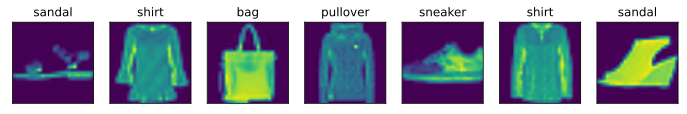
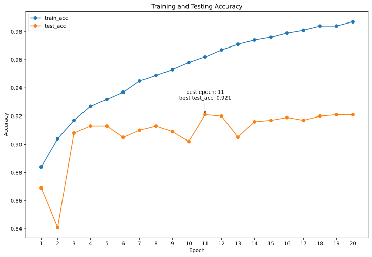

### Description:

This repository contains PyTorch implementations of AlexNet and ResNet models trained on the Fashion-MNIST dataset. The code includes data preprocessing, model training, and evaluation scripts.

Fashion-MNIST is a dataset of 60,000 training images and 10,000 testing images of fashion products. The models are trained using stochastic gradient descent with a cross-entropy loss function and TensorBoard is used to track the training process.

Pre-trained models are provided and the code includes scripts for inference on new images. The repository is a valuable resource for those interested in deep learning, image classification, and PyTorch.

### Fashion-mnist 

Fashion-mnist is an image dataset that serves as a replacement for the MNIST handwritten digit dataset. It is provided by the research department of Zalando, a German fashion technology company. The dataset includes 70,000 images of various fashion items from 10 different categories. The size, format, and training/testing set split of Fashion-mnist are identical to those of the original MNIST dataset, with 60,000 training and 10,000 testing images, all in grayscale and of size 28x28 pixels. You can use this dataset directly to test the performance of your machine learning and deep learning algorithms without modifying any code.

For this task, you are required to design, build, and train a machine learning model on the Fashion-mnist dataset that can accurately classify the labels of the testing data as much as possible.

### ResNet-4

This is a convolutional neural network (CNN) implementation in PyTorch. The network is a variant of the ResNet architecture, which is a deep CNN with residual connections. The network consists of several residual blocks, where each block has multiple convolutional layers and shortcut connections.

The input to the network is a grayscale image with a single channel, and the output is a probability distribution over the classes. The network consists of the following layers:

1. Convolutional layer with 32 output channels, kernel size 3x3, stride 1, and padding 1.
2. Batch normalization layer.
3. ReLU activation layer.
4. Max pooling layer with kernel size 3x3, stride 2, and padding 1.
5. First ResNet block with 2 residual connections, where each residual connection has 4 parallel convolutional layers with kernel sizes 1x1, 3x3, and 5x5, and a max pooling layer with kernel size 3x3. The output of the block has 32 channels.
6. Second ResNet block with 2 residual connections, where each residual connection has 4 parallel convolutional layers with kernel sizes 1x1, 3x3, and 5x5, and a max pooling layer with kernel size 3x3. The output of the block has 80 channels.
7. Third ResNet block with 2 residual connections, where each residual connection has 4 parallel convolutional layers with kernel sizes 1x1, 3x3, and 5x5, and a max pooling layer with kernel size 3x3. The output of the block has 192 channels.
8. Fourth ResNet block with 2 residual connections, where each residual connection has 4 parallel convolutional layers with kernel sizes 1x1, 3x3, and 5x5, and a max pooling layer with kernel size 3x3. The output of the block has 320 channels.
9. Global average pooling layer that averages the output feature maps over the spatial dimensions.
10. Fully connected layer with 10 output units for the 10 classes.
11. Softmax activation layer that produces a probability distribution over the classes.

The ResNet blocks are implemented using the Residual class, which takes as input the number of input and output channels, and the hyperparameters for the convolutional layers. The resnet_block function is used to create a sequence of ResNet blocks with the specified hyperparameters. The FlattenLayer class is used to flatten the output of the ResNet blocks before the fully connected layer.

#### Results

After training for 20 epochs on GTX1650, here are the accuracies on the training and test sets. We can easily see that train_acc increases rapidly, while test_acc starts to plateau from the 3rd epoch onwards, indicating the onset of overfitting.

